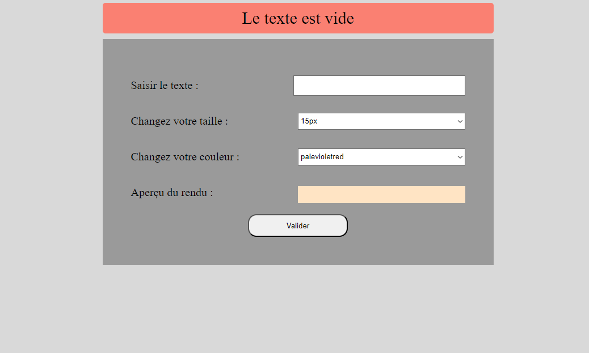
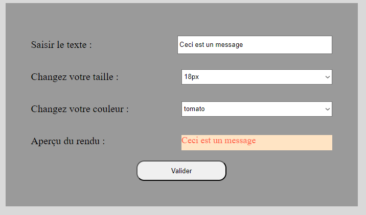
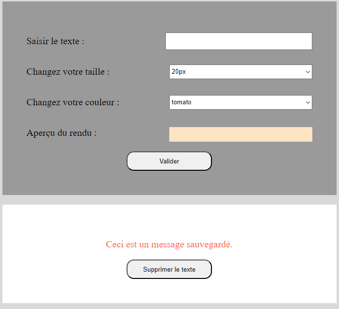

# 04_Challenge: projet

## 1. Présentation

L'application permet de sauvegarder des messages que l'on peut 
customiser, incluant la taille des caractères ou la couleur.
Ces messages sont ensuite affichés, et peuvent être supprimés si
nécessaire.


## 2. Contenu

Cette application web est réalisée sur une page simple et utilise
de l'HTML/CSS pour la mise en page, ainsi que React pour toute la 
structure qui s'occupe de l'interaction avec l'utilisateur. 

### 2.1. Initialisation

Ici, nous allons voir nos constantes et variables qui vont définir les paramètres de l'application. Voici la partie représentant ceci.

```js
//tailles proposées par l'application
const tailles = []
for (let i = 15; i < 21; i++) {
    tailles.push(`${i}px`)
}

//couleurs proposées par l'appli
const colors = ['palevioletred', 'tomato']

//incrémenteur pour générer l'id du texte
let textId=0

//état initial
const initialState = {
    taille: tailles[0],
    style: colors[0],
    text: '',
    texts: [],
    error: ''
}
```

Nous en avons actuellement 4: 
1. Un tableau contenant les tailles, elles sont générées à partir d'une boucle afin
de ne pas avoir à les écrire manuellement,
2. Un tableau contenant des couleurs pré-définies, écrites manuellement dû à leur nom spécifique
3. Un incrémenteur qui servira pour la fonction de suppression d'un message
4. Un état initial au démarrage de l'application


### 2.2. Initialisation

L'application est générée à partir d'un composant unique App, qui est la fusion de deux composants, un qui gère l'affichage du formulaire, et un qui s'occupe de l'affichage des messages ajoutés

```js
function App() {
    const [state, dispatch] = React.useReducer(reducer, initialState)
    const {style, text, texts, taille, error} = state

    //voit les données en temps réel dans la console
    React.useEffect(() =>{
        console.log(state);
    },[style,text,texts,taille])

    return (
        <React.Fragment>
            <p className='error'>{error}</p>
            <Form dispatch={dispatch} text={text} style={style} taille={taille}/>
            <Render dispatch={dispatch} texts={texts}/>
        </React.Fragment>
    )
}
```

Un reducer est utilisé pour traiter les données reçues du formulaires, ainsi que ce dernier. L'utilisation de useEffect a
permis de voir en temps réel comment évolue les données via la console, mais ce dernier n'est pas nécessaire lors de la mise en ligne. Il y a aussi une ligne chargée d'afficher des messages d'erreur lors de la validation du formulaire, afin de ne pas avoir de message vide, par exemple.

### 2.3. Formulaire

Le formulaire est nécessaire pour la sauvegarde de données souhaitées par l'utilisateur.

```js
const Form = ({dispatch,text,style,taille}) => {
    const handleSubmit = (event) => {
        event.preventDefault()
        dispatch({type:'submit'})
    }
    return (
        <form onSubmit={handleSubmit}>
            <Texte dispatch={dispatch} text={text}/>
            <Select dispatch={dispatch} choices={tailles} type='taille'/>
            <Select dispatch={dispatch} choices={colors} type='couleur'/>
            <p>Aperçu du rendu : <span style={{color:style,fontSize:taille}}>{text}</span></p>
            <button type="submit">Valider</button>
        </form>
    )
}
```

Celui-ci renvoie des composants différents selon ce qui est défini en paramètres initiaux. Dans cette application, il utilise 3 composants dont 2 différents, qui vont générer une zone de texte et un choix que l'utilisateur va faire avec un choix par défaut. Le nombre de composants du formulaire est défini par le nombre de paramètres vus dans la partie d'initialisation. On voit ainsi qu'il y a une partie pour le texte du message, une partie pour la taille en pixels, et la couleur du message. Nous avons aussi un aperçu de ce qui a été réalisé avant de valider notre formulaire, afin que l'utilisateur soit satisfait des données rentrées.

### 2.4. Messages enregistrés

Une fois le formulaire validé, nous enregistrons les données rentrées et les affichons juste en-dessous de ce dernier. Voici comment ils sont traités :

```js
const Render = ({texts,dispatch}) => {
    const handleClick = (id) => {
        dispatch({type:'delete',id:id})
    }
    return(
    <React.Fragment>
        {texts.map((text,i) =>
            <div key={i}>
                <p style={{color:text.style,fontSize:text.taille}}>{text.text}</p>
                <button onClick={()=>handleClick(text.id)}>Supprimer le texte</button>
            </div>    
        )}
    </React.Fragment>
    )
}
```

Les messages sont dans des balises de paragraphe, et affiche tout ce qui a été écrit par l'utilisateur. Chaque message possède un bouton permettant de le supprimer, qui se fait repérant le message ciblé par son identifiant, ajouté lors de la création du message.


## 3. Démonstration

Nous avons 3 images montrant différents états de l'application.

Lors de la réception d'un message d'erreur :



Image montrant l'aperçu mis dans le formulaire :



Affichage d'un message après avoir validé le formulaire :




## 4. Conclusion

Ce projet est une gestion simple de données: il en sauvegarde, en affiche et en supprime. 
La structure de ce dernier permet de faire de rapides ajouts de fonctionnalités, mais actuellement ne permet pas de vraiment customiser son message. On pourrait ajouter une échelle d'importance pour afficher les textes dans un certain ordre, mettre plus de possibilités lors de la rédaction de messages, comme mettre celui-ci en gras / souligner du contenu, ou encore modifier les messages sauvegardés, afin que l'application soit un peu plus développée.
